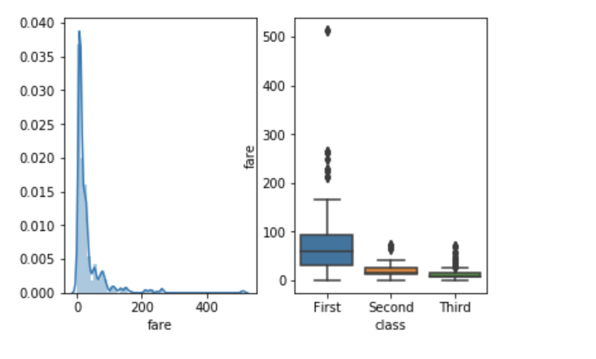

# Data-Analysis-Seaborn
This repo contains some python files in which analysis of some datasets is done by using the Seaborn Python Package. https://seaborn.pydata.org/index.html

Documentation
-------------

Online documentation is available at [seaborn.pydata.org](https://seaborn.pydata.org).

The docs include a [tutorial](http://seaborn.pydata.org/tutorial.html), [example gallery](http://seaborn.pydata.org/examples/index.html), [API reference](http://seaborn.pydata.org/api.html), and other useful information.

Dependencies
------------

Seaborn supports Python 2.7 and 3.4+.

Installation requires [numpy](http://www.numpy.org/), [scipy](http://www.scipy.org/), [pandas](http://pandas.pydata.org/), and [matplotlib](http://matplotlib.org/). Some functions will optionally use [statsmodels](http://statsmodels.sourceforge.net/) if it is installed.

Installation
------------

The latest stable release (and older versions) can be installed from PyPI:

    pip install seaborn

You may instead want to use the development version from Github:

    pip install git+https://github.com/mwaskom/seaborn.git#egg=seaborn

Testing
-------

To test seaborn, run `make test` in the source directory.

This will exercise both the unit tests and docstring examples (using `pytest`).

 
Development
-----------

Seaborn development takes place on Github: https://github.com/mwaskom/seaborn

Please submit any reproducible bugs you encounter to the [issue tracker](https://github.com/mwaskom/seaborn/issues).

